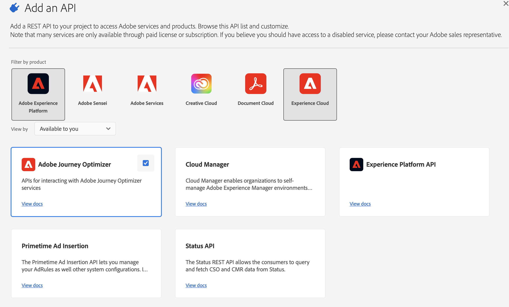

# Adobe Journey Optimizer APIs Authentication

Adobe Journey Optimizer API access is set up through the steps below. Each of these steps is detailed in the [Adobe Developer documentation](https://developer.adobe.com/developer-console/docs/guides/services/).

<InlineAlert slots="text"/>

To manage certificates in Adobe Developer, make sure you have ***System administrator*** rights on the organization or a [developer account](https://helpx.adobe.com/enterprise/using/manage-developers.html) in the Admin Console.

**Prerequisites**

1. **Check you have a digital certificate**, or create one if necessary. The public and private keys provided with the certificate are needed in the following steps.

2. **Create a new integration to Adobe Journey Optimizer Service** in Adobe Developer and configure it. Your credentials will then be generated (API Key, Client secret...).



The JWT method to generate access tokens has been deprecated. All new integrations must be created using the [OAuth Server-to-Server authentication method](https://experienceleague.adobe.com/docs/experience-platform/landing/platform-apis/api-authentication.html#select-oauth-server-to-server). Adobe also recommends that you migrate your existing integrations to the OAuth method. Read the following important documentation:

[Migration guide for your applications from JWT to OAuth](https://developer.adobe.com/developer-console/docs/guides/authentication/ServerToServerAuthentication/migration/)

[Implementation guide for new and old applications with OAuth](https://developer.adobe.com/developer-console/docs/guides/authentication/ServerToServerAuthentication/implementation/)

[Advantages of using the OAuth Server-to-Server credentials method](https://developer.adobe.com/developer-console/docs/guides/authentication/ServerToServerAuthentication/migration/#why-oauth-server-to-server-credentials)

<!--3. **Create a JSON Web Token (JWT)** from the credentials previously generated and sign it with your private key. The JWT encodes all of the identity and security information that is needed by Adobe to verify your identity and grant you access to the API.

4. **Exchange your JWT for an Access Token** through a POST request. This Access Token will have to be used in each header of your API requests.-->

To establish a secure service-to-service Adobe Developer API session, every request to an Adobe service must include in the Authorization header the information below.

```json
-X GET https://cjm.adobe.io/imp/ \
-H 'Content-Type: application/json' \
-H 'Cache-Control: no-cache' \
-H 'Authorization: Bearer <ACCESS_TOKEN>' \
-H 'X-Api-Key: <API_KEY>' \
-H 'x-gw-ims-org-id: <IMS_ORG>'
```

**IMS_ORG**: This is your personal ORGANIZATION ID, one ORGANIZATION ID is provided by Adobe for each of your instances :

To obtain your ORGANIZATION ID value, refer to your administrator or your Adobe technical contact. You can also retrieve it into Adobe Developer when creating a new integration, in the licenses list.

**ACCESS_TOKEN**: Your personal access token

**API_KEY**: your personal API Key. It is provided in Adobe Developer after creating a new integration to Adobe Journey Optimizer Service.

**Permissions needed**

You need to grant developer and API access control with the Experience Platform permissions.

After creating integrations on Adobe Developer Console, your account must have developer and user permissions for an Experience Platform product profile in Adobe Admin Console. Read this [documentation](https://experienceleague.adobe.com/docs/experience-platform/landing/platform-apis/api-authentication.html#grant-developer-and-api-access-control).

Note that you need to be sure to assign the new API profile to the expected roles in the [permissions section](https://experienceleague.adobe.com/docs/experience-platform/landing/platform-apis/api-authentication.html#assign-api-to-a-role)

Depending on the API, different permissions need to be configured:

* **Capping API** needs the "Manage Journeys Events, Data Sources and Action" permission to the targeted sandbox (Capping is configured at sandbox level).
* **Throttling API** needs the "Manage Journeys Events, Data Sources and Action" permission to the production sandbox (Throttling can only be configured on the production sandbox)
