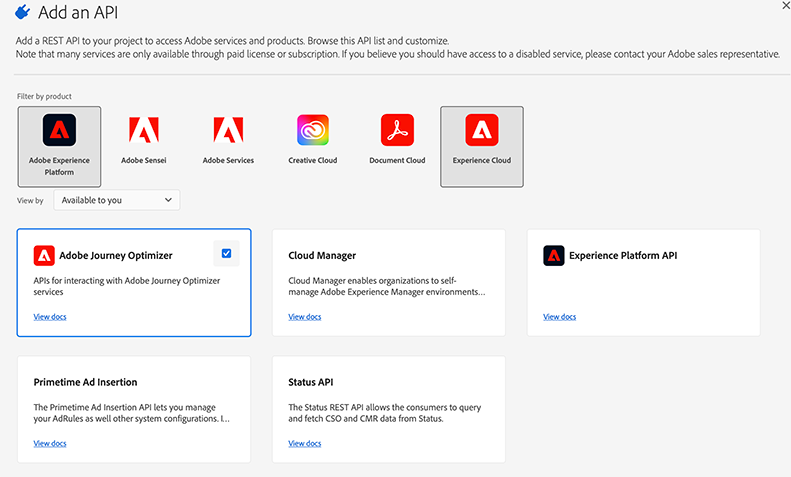

# Adobe Journey Optimizer APIs Authentication

Adobe Journey Optimizer API access is set up through the steps below. Each of these steps is detailed in the [Adobe Developer documentation](https://developer.adobe.com/developer-console/docs/guides/services/).

<InlineAlert variant="warning" slots="header, text1, text2, text3, text4" />

## JWT Deprecation Notice

The JWT method to generate access tokens has been deprecated. All new integrations must be created using the [OAuth Server-to-Server authentication method](https://experienceleague.adobe.com/docs/experience-platform/landing/platform-apis/api-authentication.html#select-oauth-server-to-server). Adobe also recommends that you migrate your existing integrations to the OAuth method. Read the following important documentation:

* [Migration guide for your applications from JWT to OAuth](https://developer.adobe.com/developer-console/docs/guides/authentication/ServerToServerAuthentication/migration/)
* [Implementation guide for new and old applications with OAuth](https://developer.adobe.com/developer-console/docs/guides/authentication/ServerToServerAuthentication/implementation/)
* [Advantages of using the OAuth Server-to-Server credentials method](https://developer.adobe.com/developer-console/docs/guides/authentication/ServerToServerAuthentication/migration/#why-oauth-server-to-server-credentials)

## Prerequisites

>[!NOTE]
>
>To manage certificates in Adobe Developer, make sure you have ***System administrator*** rights on the organization or a [developer account](https://helpx.adobe.com/enterprise/using/manage-developers.html) in the Admin Console.

Create a new integration to Adobe Journey Optimizer Service in [Adobe Developer Console](https://developer.adobe.com/console) and configure it. Your credentials will then be generated (API Key, Client secret...).

   1. [Create a new project](https://developer.adobe.com/developer-console/docs/guides/projects/projects-empty).
   2. [Add the AJO API](https://developer.adobe.com/developer-console/docs/guides/services/services-add-api-oauth-s2s).
   <br/>
   3. [Add AEP Permissions](https://experienceleague.adobe.com/en/docs/experience-platform/access-control/abac/permissions-ui/permissions#manage-api-credentials-for-role) to the *role* that coincides with the *product profile* you included for the AJO API.
   <br/>

## Authorization header

To establish a secure service-to-service Adobe Developer API session, every request to an Adobe service must include in the Authorization header the information below.

```json
-X GET https://cjm.adobe.io/imp/ \
-H 'Content-Type: application/json' \
-H 'Cache-Control: no-cache' \
-H 'Authorization: Bearer <ACCESS_TOKEN>' \
-H 'X-Api-Key: <API_KEY>' \
-H 'x-gw-ims-org-id: <IMS_ORG>'
```

* **IMS_ORG**: This is your personal ORGANIZATION ID, one ORGANIZATION ID is provided by Adobe for each of your instances :

   To obtain your ORGANIZATION ID value, refer to your administrator or your Adobe technical contact. You can also retrieve it into Adobe Developer when creating a new integration, in the licenses list.

* **ACCESS_TOKEN**: Generate an access token in the Adobe Developer Console after creating a new integration to Adobe Journey Optimizer Service.

* **API_KEY**: The client id generated by in Adobe Developer Console after creating a new integration to Adobe Journey Optimizer Service.

## Permissions

Ensure that the product profile associated with the API integration has the required permissions for the API you want to call.
Also ensure that the [AEP role associated with the product profile](https://experienceleague.adobe.com/docs/experience-platform/landing/platform-apis/api-authentication.html#assign-api-to-a-role) has been give permissions in the AEP Permissions UI.

An administrator can create the product profile in Adobe Admin Console and can also associate the API integration to the product profile.

Depending on the API, different permissions need to be configured:

* **Capping API** needs the "Manage Journeys Events, Data Sources and Action" permission to the targeted sandbox (Capping is configured at sandbox level).
* **Throttling API** needs the "Manage Journeys Events, Data Sources and Action" permission to the production sandbox (Throttling can only be configured on the production sandbox)
* **Journey API** needs the "Journey Manage" and "Journey View" permissions to the targeted sandbox.
